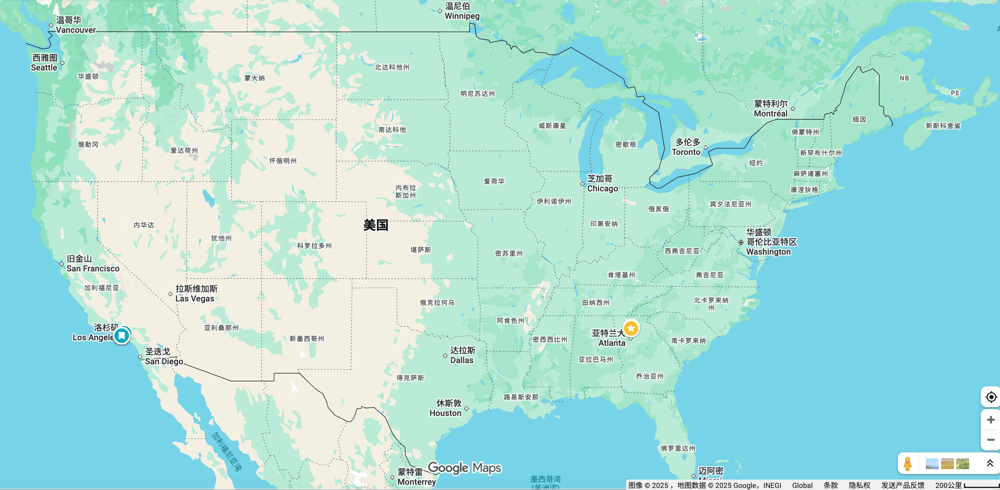

# 美国本科选校知识库

面向中国学生与家庭的美国本科区域选校指南。内容以城市和区域为入口，帮助读者同时比较学校、专业、费用、国际生资助、交通、就业环境，以及每所学校需要认真考虑的一面。

> 当前收录：**33 份区域指南**，覆盖美国 50 州及主要本科留学城市带。
>
> 费用、奖学金和国际生政策会变化。文档提供研究起点，正式申请前请以学校官网、I-20 资金要求和本人录取奖学金通知为准。

## 快速开始

- 想看高校最密集的传统留学地区：从 [Boston](boston.md)、[New York City](new-york.md)、[Philadelphia](philadelphia-and-eastern-pennsylvania.md) 开始。
- 想看科技、工程与创业：从 [San Francisco Bay Area](san-francisco-bay-area.md)、[Seattle & Washington](seattle-and-washington-state.md)、[Texas](texas.md) 开始。
- 想看费用相对可控的公立大学：浏览 [Great Plains](great-plains-missouri-kansas-nebraska.md)、[Northern Plains & Montana](northern-plains-and-montana.md)、[Alabama & Mississippi](alabama-and-mississippi.md)。
- 想看气候、环境与海洋特色：浏览 [Alaska & Hawaiʻi](alaska-and-hawaii.md)、[Pacific Northwest](pacific-northwest-beyond-seattle.md)、[Delaware & Delmarva](delaware-and-delmarva.md)。
- 想按学校查找：在 GitHub 页面按 `/`，输入英文或中文校名进行仓库搜索。

## 东北部与大西洋沿岸

| 区域指南 | 主要覆盖 | 适合关注 |
|---|---|---|
| [Boston 都市圈](boston.md) | Boston、Cambridge 及周边 | 顶尖研究、工程、生物医药、商科、文理学院 |
| [Boston 以外的新英格兰](new-england-beyond-boston.md) | Maine、New Hampshire、Vermont、Connecticut、Rhode Island | 文理学院、公立旗舰、海洋、环境、工程 |
| [New York City 都市圈](new-york.md) | Manhattan、Brooklyn、Bronx、Queens 及周边 | 金融、传媒、艺术、商科、科技、城市资源 |
| [Upstate New York](upstate-new-york.md) | Ithaca、Rochester、Syracuse、Buffalo、Troy | 工程、计算、光学、建筑、文理教育 |
| [New Jersey](new-jersey.md) | Princeton、New Brunswick、Newark、Hoboken | 工程、商科、生命科学、纽约就业连接 |
| [Philadelphia 与宾州东部](philadelphia-and-eastern-pennsylvania.md) | Philadelphia、Bethlehem、Swarthmore 及周边 | 医疗、工程、商科、文理学院、城市实践 |
| [Pennsylvania：Philadelphia 以外](pennsylvania-beyond-philadelphia.md) | Pittsburgh、State College、Central Pennsylvania | 工程、计算、商科、科研、公立旗舰 |
| [Delaware & Delmarva](delaware-and-delmarva.md) | Delaware、Maryland Eastern Shore | 化工、农业、航空、护理、HBCU、环境 |
| [Washington, D.C. 与 Maryland](washington-dc-and-maryland.md) | D.C.、Baltimore、College Park 及周边 | 政策、国际关系、医学、工程、政府资源 |

## 南部与东南部

| 区域指南 | 主要覆盖 | 适合关注 |
|---|---|---|
| [Virginia](virginia.md) | Charlottesville、Williamsburg、Blacksburg、Richmond | 公立旗舰、工程、商科、历史、文理教育 |
| [North Carolina Research Triangle](north-carolina-research-triangle.md) | Raleigh、Durham、Chapel Hill 及周边 | 生物医药、科研、工程、计算、公共健康 |
| [South Carolina](south-carolina.md) | Columbia、Clemson、Charleston 及周边 | 工程、商科、酒店、海洋、文理教育 |
| [Atlanta & Georgia](atlanta-and-georgia.md) | Atlanta、Athens、Macon 及周边 | 工程、商科、公共健康、传媒、企业资源 |
| [Florida](florida.md) | Miami、Gainesville、Tallahassee、Orlando、Tampa | 商科、旅游、航空航天、海洋、医学 |
| [Tennessee](tennessee.md) | Nashville、Knoxville、Memphis、Sewanee | 音乐、医疗、工程、物流、文理学院 |
| [Kentucky & West Virginia](kentucky-and-west-virginia.md) | Lexington、Louisville、Morgantown、Huntington | 医疗、工程、能源、农业、商科 |
| [Alabama & Mississippi](alabama-and-mississippi.md) | Birmingham、Tuscaloosa、Auburn、Oxford、Starkville | 工程、航空、商科、农业、奖学金 |
| [Louisiana](louisiana.md) | New Orleans、Baton Rouge、Lafayette、Ruston | 能源、海岸、音乐、商科、工程、文化研究 |
| [Arkansas & Oklahoma](arkansas-and-oklahoma.md) | Fayetteville、Little Rock、Norman、Tulsa、Stillwater | 供应链、能源、航空、农业、商科 |
| [Texas](texas.md) | Austin、Houston、Dallas–Fort Worth、College Station、San Antonio | 工程、能源、计算、医疗、商科、航空 |

## 中西部与大平原

| 区域指南 | 主要覆盖 | 适合关注 |
|---|---|---|
| [Chicago & Illinois](chicago-and-illinois.md) | Chicago、Evanston、Champaign-Urbana 及周边 | 金融、工程、计算、建筑、城市资源 |
| [Indiana](indiana.md) | Bloomington、West Lafayette、Notre Dame、Indianapolis | 工程、商科、音乐、医学、文理教育 |
| [Michigan & Ohio](michigan-and-ohio.md) | Ann Arbor、Detroit、East Lansing、Columbus、Cleveland | 汽车、工程、制造、商科、医学、艺术 |
| [Upper Midwest](upper-midwest-minnesota-wisconsin-iowa.md) | Minnesota、Wisconsin、Iowa | 公立旗舰、农业、工程、医疗、保险金融 |
| [Great Plains](great-plains-missouri-kansas-nebraska.md) | Missouri、Kansas、Nebraska | 农业、航空、工程、新闻、医学、商科 |

## 西部、太平洋与山地地区

| 区域指南 | 主要覆盖 | 适合关注 |
|---|---|---|
| [San Francisco Bay Area](san-francisco-bay-area.md) | San Francisco、Berkeley、Stanford、San Jose | 科技、创业、工程、计算、生命科学 |
| [Los Angeles](los-angeles.md) | Los Angeles、Pasadena、Claremont 及周边 | 影视、工程、商科、设计、文理学院 |
| [California：湾区与洛杉矶以外](california-beyond-bay-area-and-los-angeles.md) | San Diego、Santa Barbara、Davis、Irvine、Central Valley | 生物科技、海洋、农业、工程、公立大学 |
| [Seattle & Washington State](seattle-and-washington-state.md) | Seattle、Tacoma、Bellingham、Pullman、Walla Walla | 科技、航空、工程、商业、环境 |
| [Pacific Northwest：Seattle 以外](pacific-northwest-beyond-seattle.md) | Oregon、Idaho 及区域城市 | 半导体、体育商业、林业、农业、文理学院 |
| [Rocky Mountain & Southwest](rocky-mountain-and-southwest.md) | Colorado、Utah、Arizona、New Mexico、Nevada、Wyoming | 航空航天、地球、能源、计算、酒店、户外 |
| [Northern Plains & Montana](northern-plains-and-montana.md) | Montana、North Dakota、South Dakota | 航空、农业、工程、自然资源、护理、药学 |
| [Alaska & Hawaiʻi](alaska-and-hawaii.md) | Honolulu、Hilo、Anchorage、Fairbanks、Juneau | 海洋、天文、北极、能源、旅游、原住民研究 |

## 按专业方向导航

| 目标方向 | 建议优先浏览 |
|---|---|
| 计算机、AI、软件与创业 | [Bay Area](san-francisco-bay-area.md) · [Seattle](seattle-and-washington-state.md) · [Boston](boston.md) · [Texas](texas.md) |
| 工程、制造与航空航天 | [Michigan & Ohio](michigan-and-ohio.md) · [Indiana](indiana.md) · [Los Angeles](los-angeles.md) · [Rocky Mountain & Southwest](rocky-mountain-and-southwest.md) |
| 金融、咨询、商业与供应链 | [New York City](new-york.md) · [Chicago](chicago-and-illinois.md) · [Texas](texas.md) · [Arkansas & Oklahoma](arkansas-and-oklahoma.md) |
| 生物、医学、护理与公共健康 | [Boston](boston.md) · [Research Triangle](north-carolina-research-triangle.md) · [D.C. & Maryland](washington-dc-and-maryland.md) · [Florida](florida.md) |
| 农业、食品与自然资源 | [Upper Midwest](upper-midwest-minnesota-wisconsin-iowa.md) · [Great Plains](great-plains-missouri-kansas-nebraska.md) · [Northern Plains & Montana](northern-plains-and-montana.md) |
| 海洋、环境、气候与地球科学 | [Alaska & Hawaiʻi](alaska-and-hawaii.md) · [California 其他地区](california-beyond-bay-area-and-los-angeles.md) · [Pacific Northwest](pacific-northwest-beyond-seattle.md) · [Delmarva](delaware-and-delmarva.md) |
| 传媒、影视、音乐与创意写作 | [Los Angeles](los-angeles.md) · [New York City](new-york.md) · [Tennessee](tennessee.md) · [Northern Plains & Montana](northern-plains-and-montana.md) |
| 政治、国际关系与公共政策 | [D.C. & Maryland](washington-dc-and-maryland.md) · [Virginia](virginia.md) · [New York City](new-york.md) · [New England](new-england-beyond-boston.md) |
| 小型文理学院 | [New England](new-england-beyond-boston.md) · [Philadelphia](philadelphia-and-eastern-pennsylvania.md) · [Los Angeles](los-angeles.md) · [Delmarva](delaware-and-delmarva.md) |

## 如何使用每份指南

建议按以下顺序阅读，而不是只看学校排名：

1. **区域特点**：判断气候、交通、产业和生活环境是否适合。
2. **学校定位与优势方向**：确认学校资源是否匹配目标专业。
3. **费用与国际生资助**：使用完整 COA 和本人奖学金计算四年净价。
4. **适合与不适合**：快速排除校园类型或培养方式不匹配的学校。
5. **需要认真考虑的一面**：检查学业压力、专业准入、地理限制和就业身份风险。
6. **区域选校与专业对照**：形成初选名单后，再进入学校官网验证最新政策。

## 内容说明

- 中文校名用于帮助检索，申请材料请始终使用学校官方英文名称。
- 费用通常包括学费、费用、住宿、餐饮及学校公布的间接预算；机票、保险和专业附加费可能另计。
- “适合/不适合”与风险提示是决策框架，不是对学校质量的简单评价。
- 所有学校数据都应在申请当年重新核实，尤其是奖学金、国际生资助、专业准入和 I-20 资金要求。
